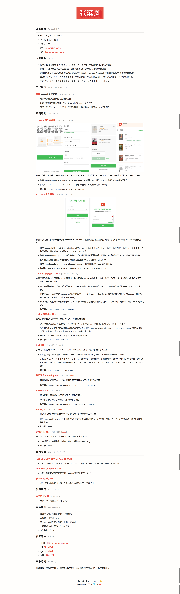

# Re-Resume 🤓
Another resume generator or template.
Simple but useful.
Instant resume with no config!

[中文版自述](README_zh.md)

### Preview



## Feature
- Simplicity. Just a resume template
- Typography, responsive image.
- Atom components, with higly customize
- SEO optimization

## Usage
1. Edit `src/Me/index.js`， fill the content field
2. `yarn start`，then open `localhost:3000`
3. Done.

## Customize
  - `src/typography/Typography/index.js`，override typography
  - `src/components/themes/default.js`，config color theme
```
bio contains:

    name : string
    role : string
    contacts : an object with
          mobile: string
          email: string
          github: string
          twitter: string (optional)
          location: string
    welcomeMessage: string
    skills: array of strings
    biopic: string url
    display: function taking no parameters


education contains:

    schools: array of objects with
         name: string
         location: string
         degree: string
         majors: array of strings
         dates: string (works with a hyphen between them)
         url: string
    onlineCourses: array of objects with
         title: string
         school: string
         dates: string (works with a hyphen between them)
         url: string
    display: function taking no parameters


work contains

    jobs: array of objects with
         employer: string
         title: string
         location: string
         dates: string (Can be 'in progress')
         description: string
    display: function taking no parameters


projects contains:

    projects: array of objects with
          title: string
          dates: string (works with a hyphen between them)
          description: string
          images: array with string urls
    display: function taking no parameters
```
### Tech Stacks
- React
- React-Router
- Webpack2 / Webpack-blocks
- normalizr
- styled-components
- Storybook

### 0. Install
`npm install`

### 1. Dev
`[PORT=xxx] [HOST=xxx] [PUBLIC_PATH=xxx] npm run dev`

### 2. Build
`[PORT=xxx] [HOST=xxx] [PUBLIC_PATH=xxx] npm run build`


#### Credits
- styled-components
- Typography


---
#### Based on [Rocket 🚀](https://github.com/cool4zbl/rocket)
